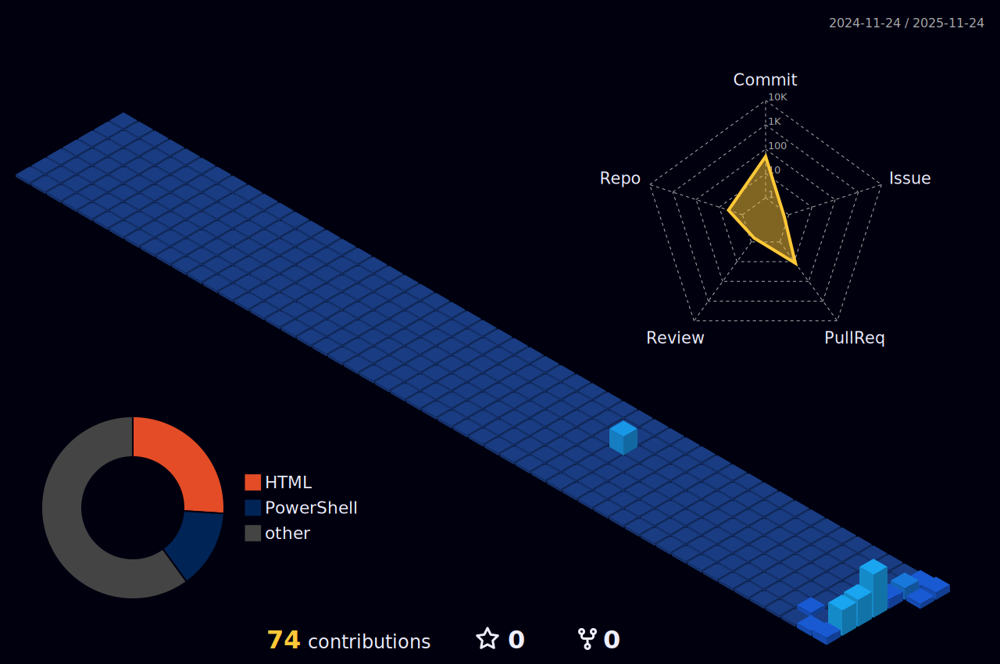
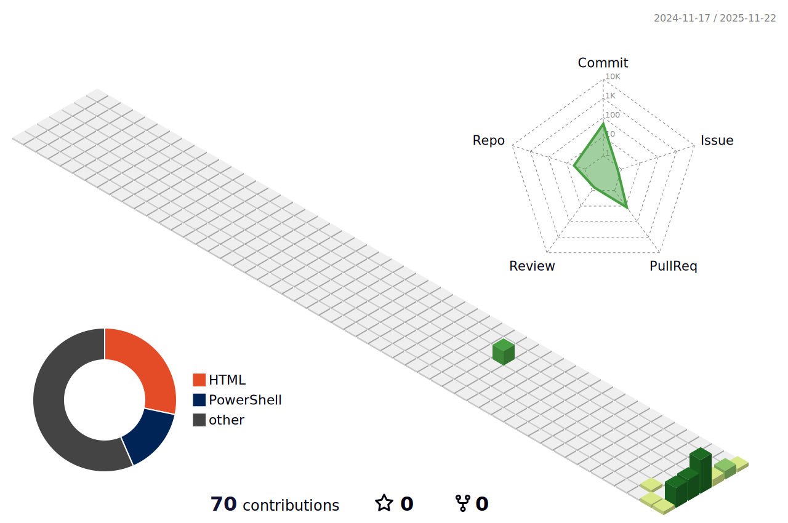

<!-- HEADER: Minimalist, High-Contrast, Engineering Focused -->

### **Cloud Architecture | Site Reliability Engineering | DevSecOps**

<!-- SOCIALS: Uniform, Professional "Badge" Style -->

  
  
  
  <!-- NOTE: Strongly recommend using a Gmail or custom domain for FAANG applications -->
  

---

### 👨‍💻 **Engineering Philosophy**

I design and implement **fault-tolerant, self-healing distributed systems** at scale. My work focuses on the intersection of infrastructure complexity and operational simplicity.

*   🔭 **Current Architecture:** Orchestrating multi-region Kubernetes clusters using **Istio Service Mesh** and **ArgoCD** for GitOps-driven delivery.
*   🔬 **Research Interest:** Leveraging **eBPF** for kernel-level observability and implementing rigorous Chaos Engineering (Gremlin/Chaos Mesh) to validate system resiliency.
*   ⚡ **Core Principle:** Infrastructure as Code is standard; **Infrastructure as Data** is the future.

---

### 🛠 **Technical Arsenal**

<!-- Use a table for cleaner alignment - a very "Academic" look -->
<table>
  <tr>
    <td align="center" width="25%"><b>Cloud & Compute</b></td>
    <td align="center" width="25%"><b>Orchestration</b></td>
    <td align="center" width="25%"><b>IaC & Automation</b></td>
    <td align="center" width="25%"><b>Observability</b></td>
  </tr>
  <tr>
    <td align="center">
      
    </td>
    <td align="center">
      
    </td>
    <td align="center">
      
    </td>
    <td align="center">
      
    </td>
  </tr>
</table>

 

<!-- LANGUAGE STRIP -->

---

  
  <!-- TITLE -->
  <h1>Hi there, I'm <a href="https://github.com/richardmussell">Richard Mussell</a>! </h1>

  <!-- 3D CITY (Spans full width) -->
  

    

  <!-- DASHBOARD ROW (Snake + Stats) -->
  <table>
    <tr>
      <td valign="top" width="50%">
        <h3 align="center">🐍 Contribution Snake</h3>
        

          
        

      </td>
      <td valign="top" width="50%">
        <h3 align="center">📊 GitHub Stats</h3>
        

          <!-- REPLACE 'YOUR_USERNAME' BELOW -->
          
           
          
        

      </td>
    </tr>
  </table>
  

---

### 🧩 Contribution Activity

<!-- 3D CITY SKYLINE -->

  

 

<!-- SNAKE GAME -->
<!-- Requires: snake.yml workflow. The recruiter favorite. -->

  

  <i>Generating resilient infrastructure, one commit at a time.</i>

